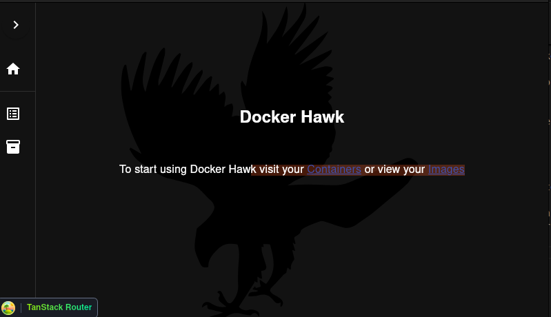
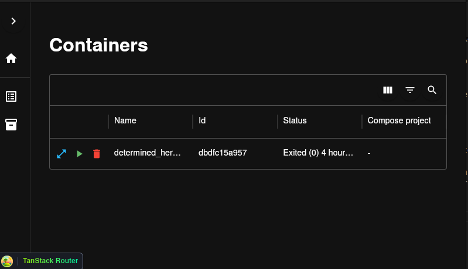
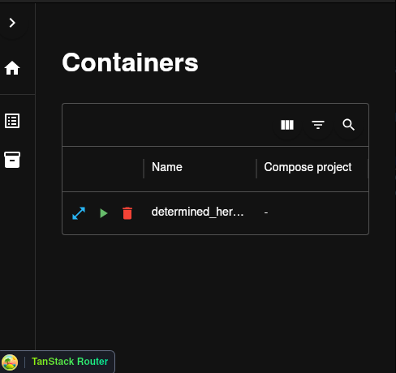
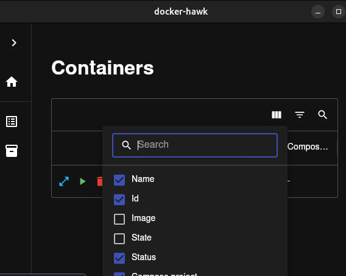
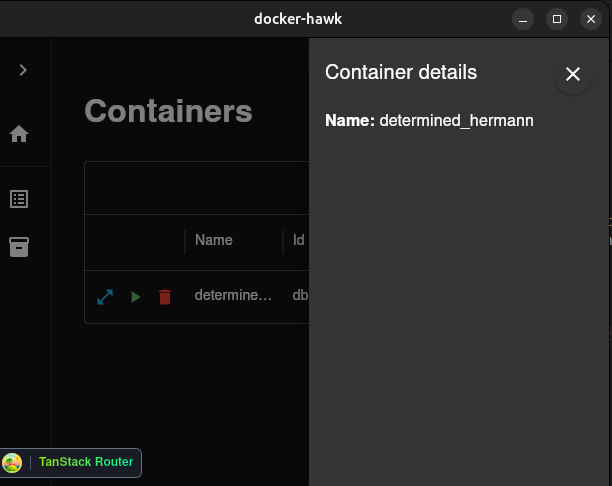
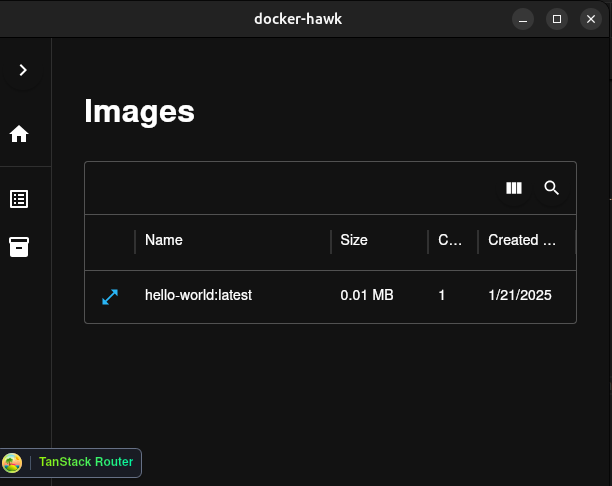
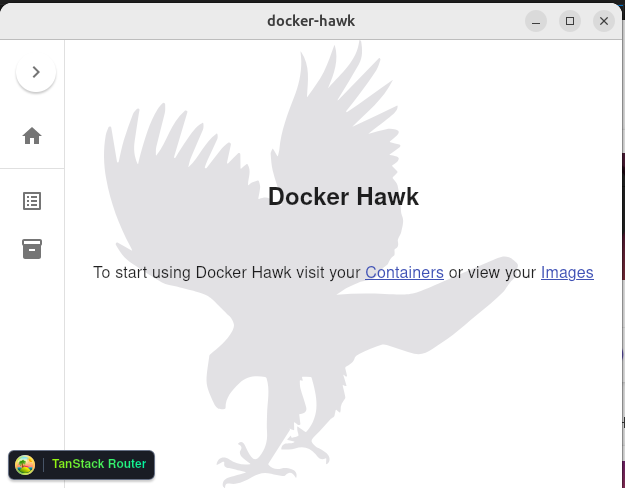
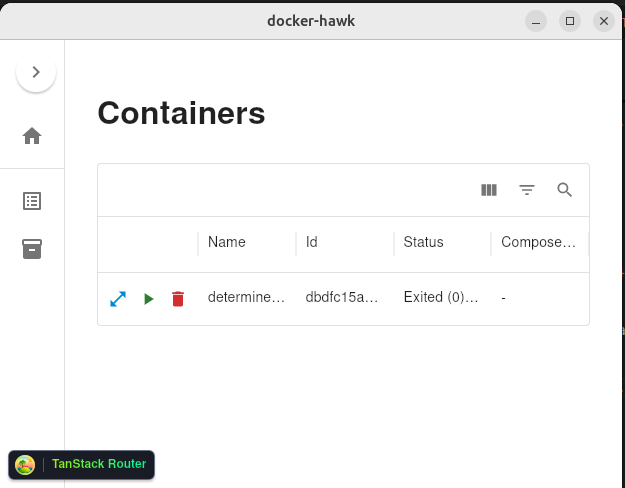

This is a simple app to manage docker containers built with Tauri. It is very much a work in progress and there are some major limitations (see the TODO section).

> [!WARNING]
> Please note that the app currently requires the Docker Daemon to be running before the app is started, I plan on fixing this when I have the time (point one in the TODO section).

> [!WARNING]
> This app primarily targets Linux given Linux supports running the Docker Engine as a standalone process (automatically starting the Docker Daemon on start up), on other platforms (Mac/Windows) Docker Desktop may be required to start the Docker Daemon.

# TODO
- Add in error handling, for instance the app currently crashes if the docker daemon is not running
- Add container ports to container table
- Update the data shown in the expanded panel when a row is clicked
- Consider storing containers and images in state so we don't have to refetch them
- Update containers and images periodically or via bollards event system https://docs.rs/bollard/latest/bollard/struct.Docker.html#method.events
- Consider what to do if the docker daemon stops while the app is running
- Consider moving to TanstackTable as this has more free features over MUI DataGrid
- Make select columns dropdown scrollable

# Getting Started
- Install Rust https://doc.rust-lang.org/cargo/getting-started/installation.html
- Select node version 20 with NVM
- cd into `./src`
- Run `npm install`
- If not on Linux, start Docker desktop to start the Docker Daemon
- Run `npm run tauri dev` from the root

# Recommended IDE Setup
- [VS Code](https://code.visualstudio.com/) + [Tauri](https://marketplace.visualstudio.com/items?itemName=tauri-apps.tauri-vscode) + [rust-analyzer](https://marketplace.visualstudio.com/items?itemName=rust-lang.rust-analyzer)

# App Examples
Home page:

Container list:

Container list small screen:
 
Columns are automatically hidden when you go to a smaller screen size. These can be overriden by manually changing the displayed columns
 

Manually set columns:
 

Container details:
 
More information about the container will be added here in the future.
 

Image list:
 

Light mode home:
 

Light mode container list:
 

