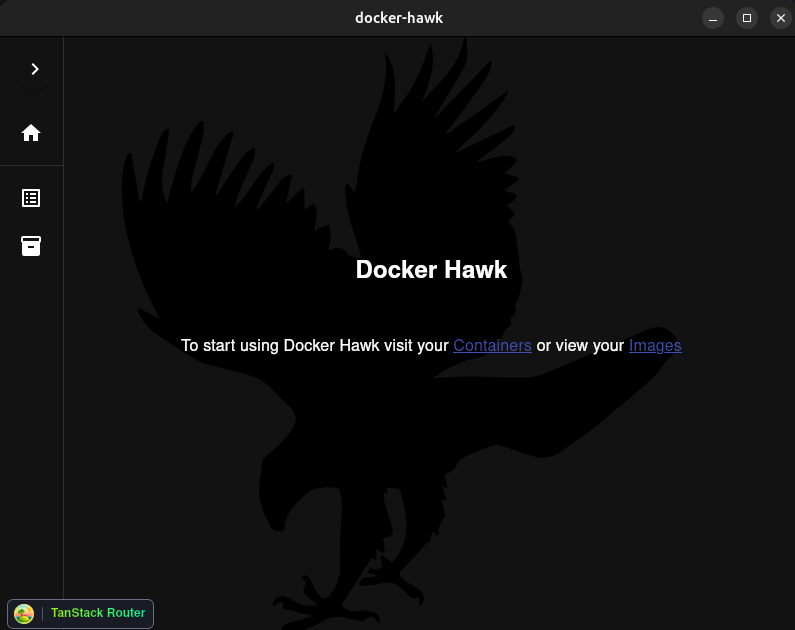
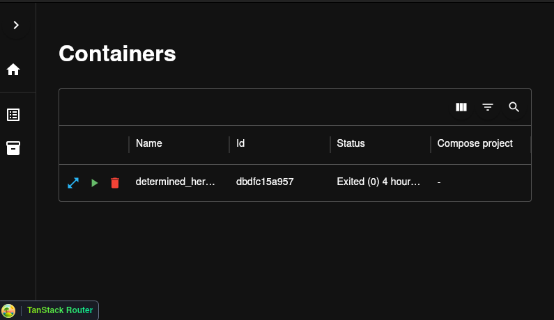
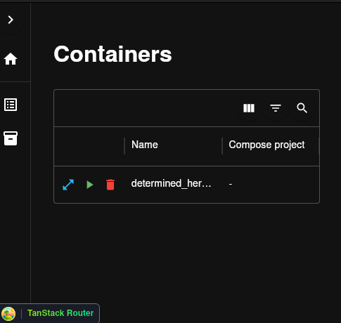
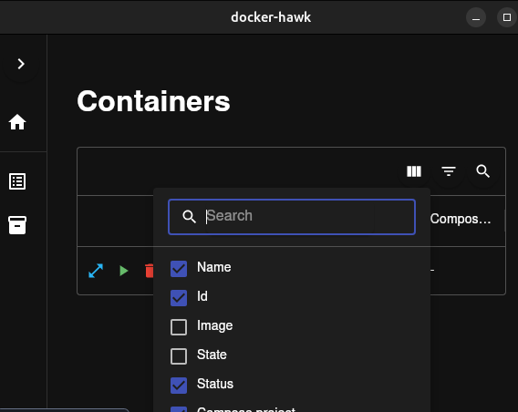
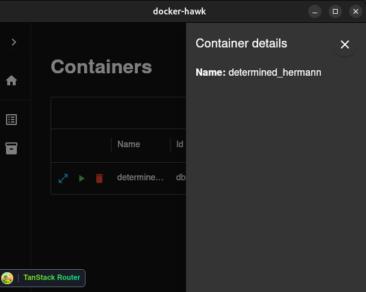
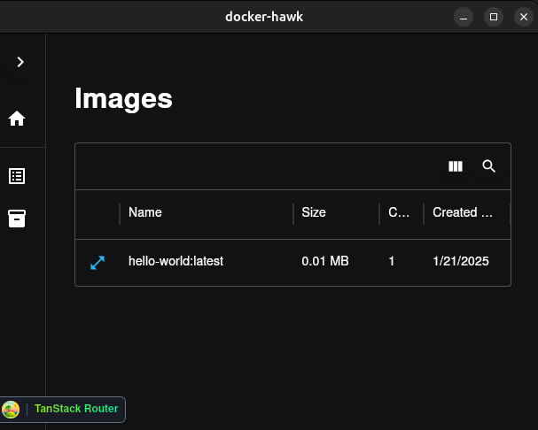
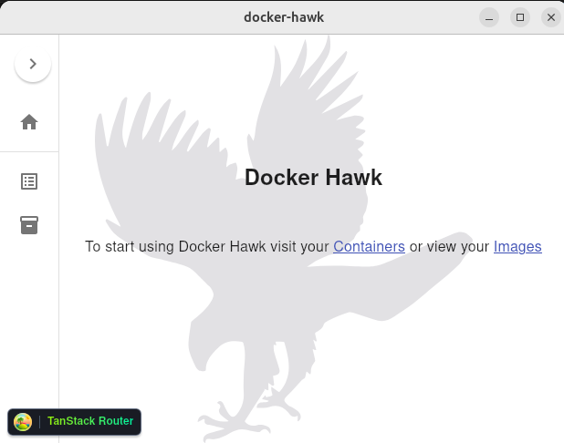
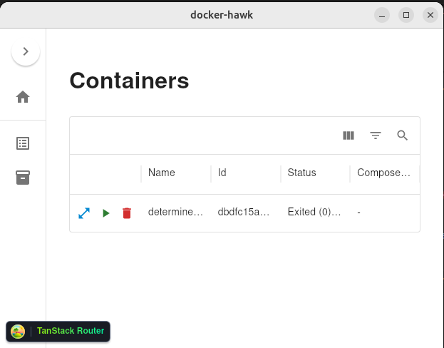

This is a simple app to manage docker containers built with Tauri. It is very much a work in progress and there are some major limitations (see the TODO section).

> [!WARNING]
> Please note that the app currently requires the Docker Daemon to be running before the app is started (point one in the TODO section).

> [!WARNING]
> This app primarily targets Linux given Linux supports running the Docker Engine as a standalone process (automatically starting the Docker Daemon on start up), other platforms (Mac/Windows) are more difficult, I will investigate solutions involving Colima/WSL.
You can currently run on these platforms by starting the Docker Daemon through Docker Desktop.

# TODO

- Improve error handling i.e. fail gracefully when the docker dameon is not running or the event listener crashes and implement restart procedures
- (In Progress) Update containers and images periodically or via bollards event system https://docs.rs/bollard/latest/bollard/struct.Docker.html#method.events

- Consider moving to TanstackTable as this has more free features over MUI DataGrid
- Improve sorting and filtering in the tables (visually and adding more options)
- General fleshing out of the UI, add new columns to tables, better selection of data shown, populate expandable rows
- Make column selection dropdown scrollable when it goes off the screen

# Getting Started

- Install Rust https://doc.rust-lang.org/cargo/getting-started/installation.html
- Select node version 20 with NVM
- cd into `./src`
- Run `npm install`
- If not on Linux, start Docker desktop to start the Docker Daemon
- Run `npm run tauri dev` from the root

# Recommended IDE Setup

- [VS Code](https://code.visualstudio.com/) + [Tauri](https://marketplace.visualstudio.com/items?itemName=tauri-apps.tauri-vscode) + [rust-analyzer](https://marketplace.visualstudio.com/items?itemName=rust-lang.rust-analyzer)

# App Examples

Home page:

Container list:

Container list small screen:
 
Columns are automatically hidden when you go to a smaller screen size. These can be overriden by manually changing the displayed columns.
 

Manually set columns:
 

Container details:
 
More information about the container will be added here in the future.
 

Image list:
 

Light mode home:
 

Light mode container list:
 

